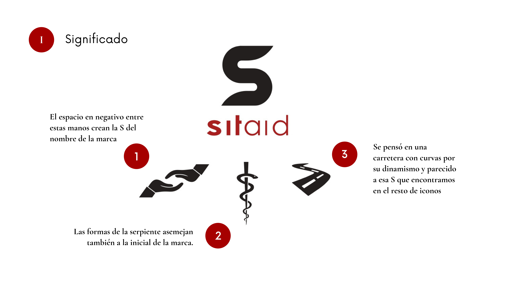
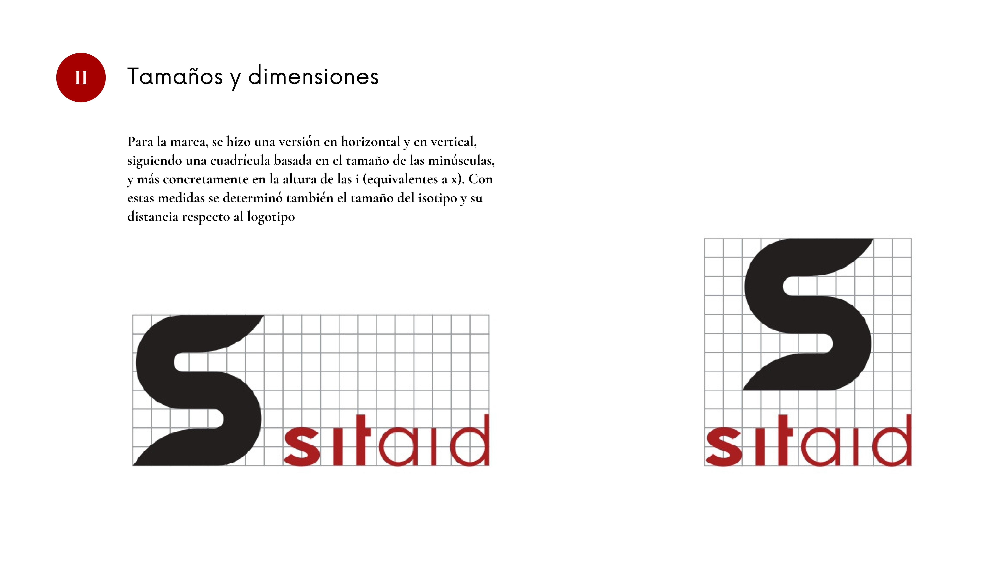
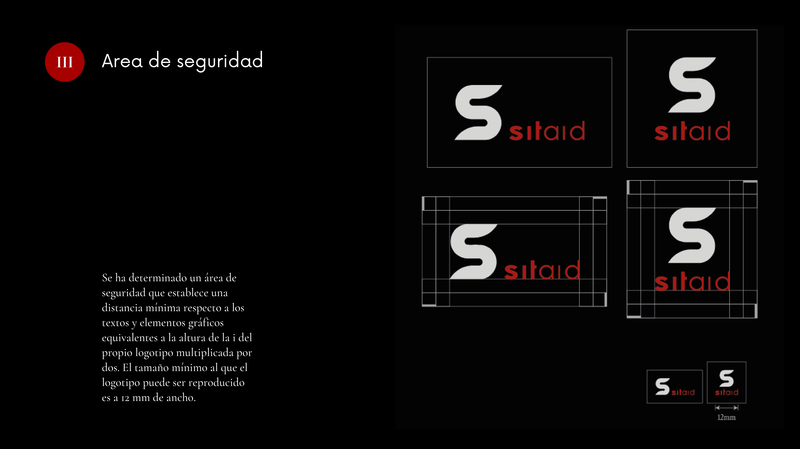
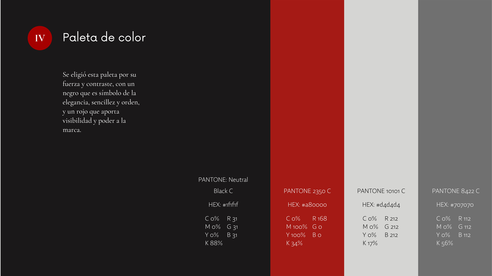
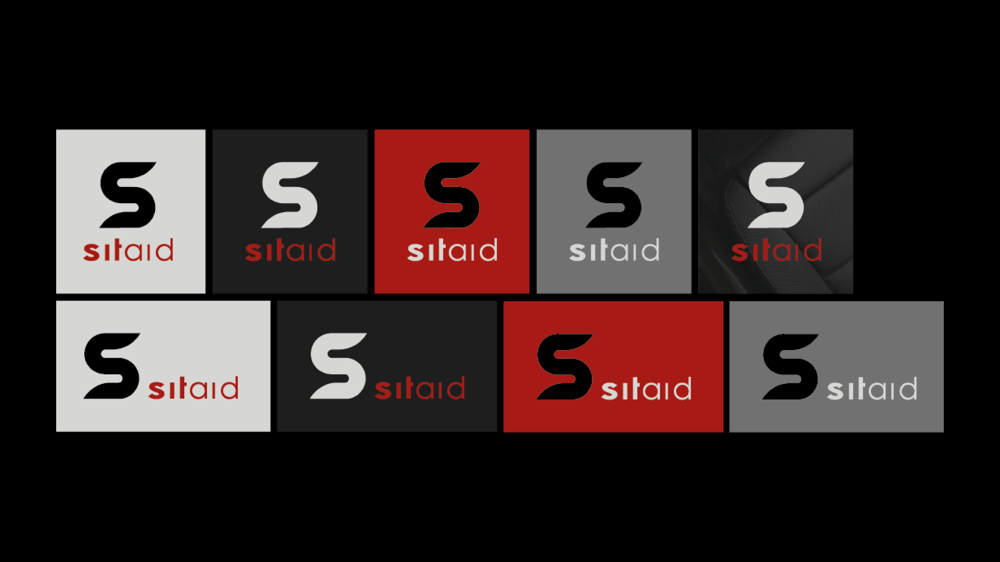

Sitaid is the identity designed for a product aimed at enhancing the autonomy of individuals with motor disabilities. A product that will assist them in getting in and out of the car without the need for strength or abrupt movements. Therefore, Sitaid needed to be a highly descriptive brand, with a fluid symbol capable of providing uniqueness, differentiation, and strength to the brand.

  

    <button type="button" data-bs-target="#carouselExampleIndicators" data-bs-slide-to="0" class="active" aria-current="true" aria-label="Slide 1"></button>
    <button type="button" data-bs-target="#carouselExampleIndicators" data-bs-slide-to="1" aria-label="Slide 2"></button>
    <button type="button" data-bs-target="#carouselExampleIndicators" data-bs-slide-to="2" aria-label="Slide 3"></button>
    <button type="button" data-bs-target="#carouselExampleIndicators" data-bs-slide-to="3" aria-label="Slide 4"></button>
    <button type="button" data-bs-target="#carouselExampleIndicators" data-bs-slide-to="4" aria-label="Slide 5"></button>
    <button type="button" data-bs-target="#carouselExampleIndicators" data-bs-slide-to="5" aria-label="Slide 6"></button>
  

  

    

      
    

    

      
    

    

      
    

    

      
    

    

      
    

  

  <button class="carousel-control-prev" type="button" data-bs-target="#carouselExampleIndicators" data-bs-slide="prev">
    
    Previous
  </button>
  <button class="carousel-control-next" type="button" data-bs-target="#carouselExampleIndicators" data-bs-slide="next">
    
    Next
  </button>

