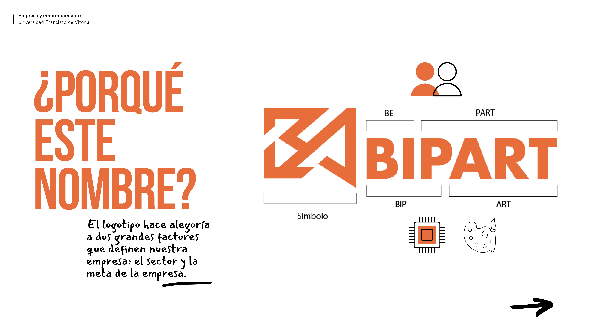
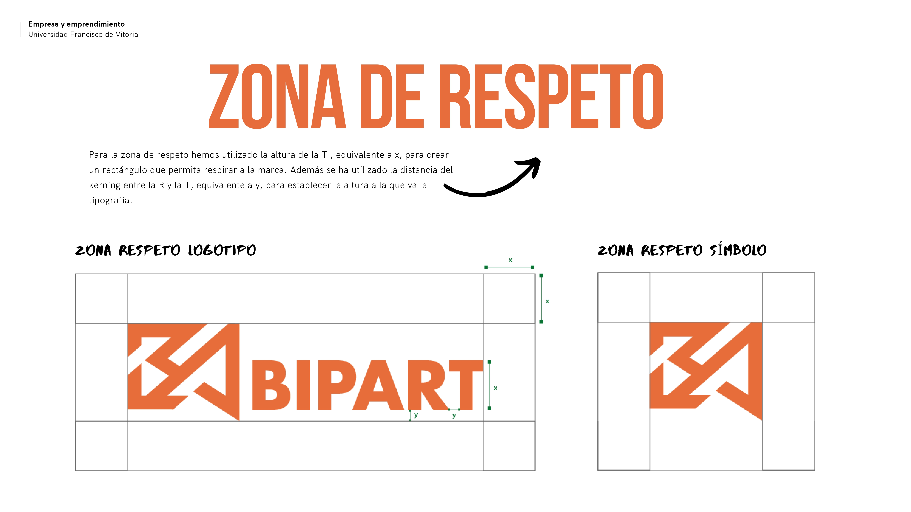
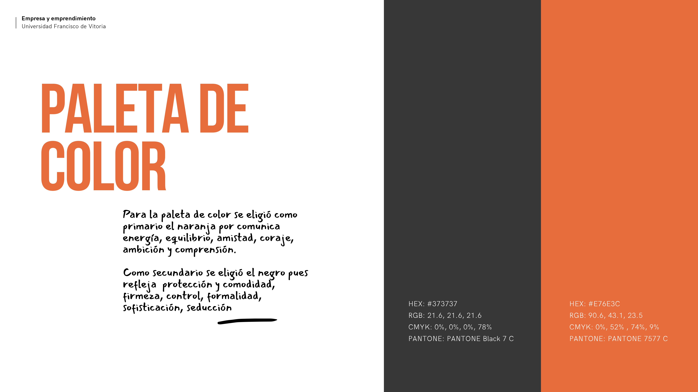

Bipart is a branding that has been developed for a startup with the objective of providing a practical, objective, and innovative solution for the artists and freelancers in the Madrid community. The main aim of this solution is to assist them in optimizing their financial management and cost savings..

  <ol class="carousel-indicators">
    <li data-target="#carouselExampleIndicators" data-slide-to="0" class="active"></li>
    <li data-target="#carouselExampleIndicators" data-slide-to="1"></li>
    <li data-target="#carouselExampleIndicators" data-slide-to="2"></li>
    <li data-target="#carouselExampleIndicators" data-slide-to="3"></li>
    <li data-target="#carouselExampleIndicators" data-slide-to="4"></li>
    <li data-target="#carouselExampleIndicators" data-slide-to="5"></li>
 
  </ol>
  

    

      
    

    

      
    

    

      
    

    

      
    

    

      
    

  

  <a class="carousel-control-prev" href="#carouselExampleIndicators" role="button" data-slide="prev">
    
    Previous
  </a>
  <a class="carousel-control-next" href="#carouselExampleIndicators" role="button" data-slide="next">
    
    Next
  </a>

