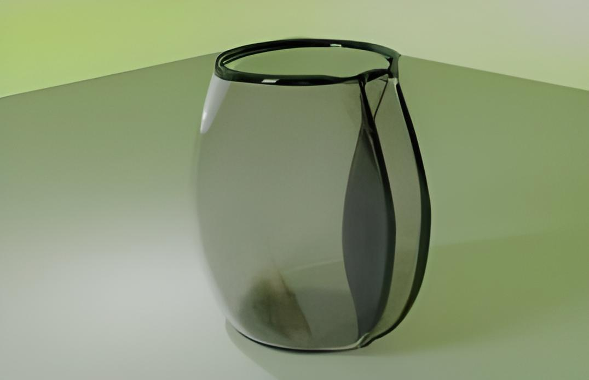
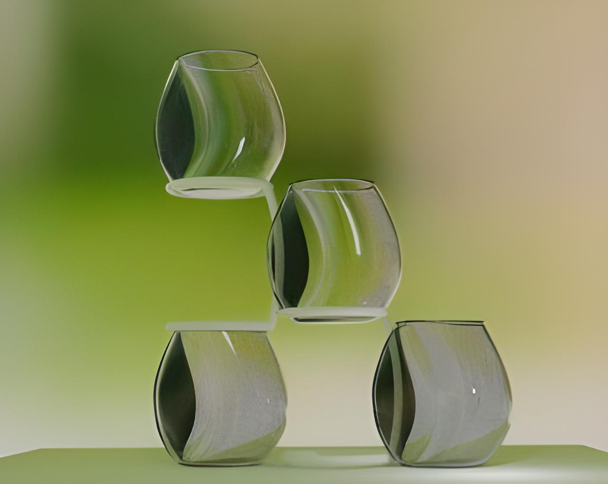
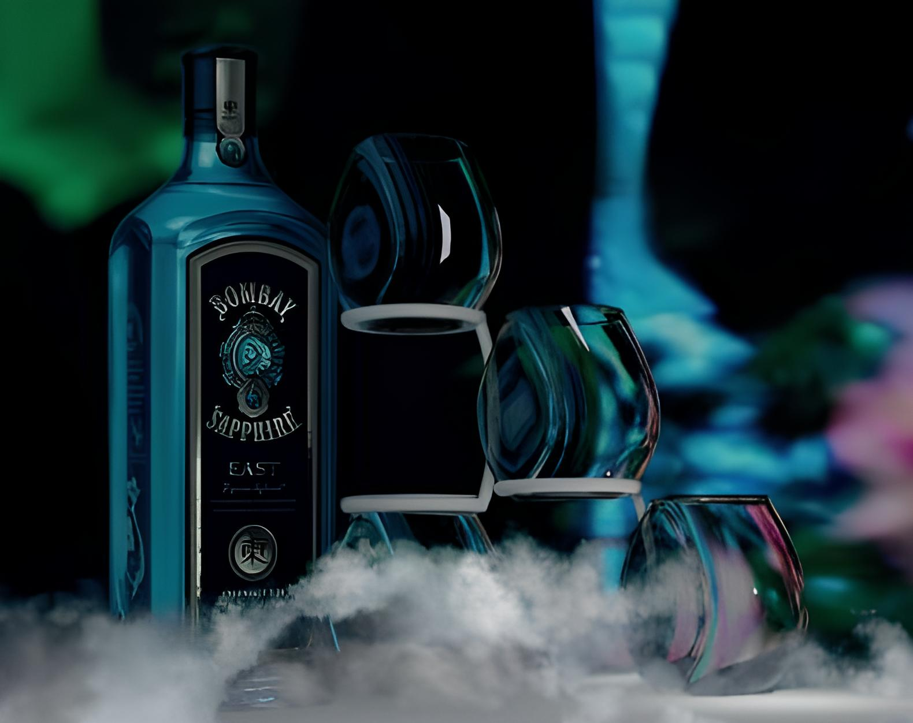

For this project we were inspired by nature and eco-aesthetics, to create a cup for Bombay Shappire that was not only useful, but also allegorical (drinking from it feels like receiving a kiss). The aim was to incorporate shapes that could increase their resistance to breakage and enhance their stability during use, with delicate curves, and a slit in one of its sides that allows them to be stacked.

  

    <button type="button" data-bs-target="#carouselExampleIndicators" data-bs-slide-to="0" class="active" aria-current="true" aria-label="Slide 1"></button>
    <button type="button" data-bs-target="#carouselExampleIndicators" data-bs-slide-to="1" aria-label="Slide 2"></button>
    <button type="button" data-bs-target="#carouselExampleIndicators" data-bs-slide-to="2" aria-label="Slide 3"></button>
    <button type="button" data-bs-target="#carouselExampleIndicators" data-bs-slide-to="3" aria-label="Slide 4"></button>
    <button type="button" data-bs-target="#carouselExampleIndicators" data-bs-slide-to="4" aria-label="Slide 5"></button>
    <button type="button" data-bs-target="#carouselExampleIndicators" data-bs-slide-to="5" aria-label="Slide 6"></button>
    <button type="button" data-bs-target="#carouselExampleIndicators" data-bs-slide-to="6" aria-label="Slide 7"></button>
    <button type="button" data-bs-target="#carouselExampleIndicators" data-bs-slide-to="7" aria-label="Slide 8"></button>
    <button type="button" data-bs-target="#carouselExampleIndicators" data-bs-slide-to="8" aria-label="Slide 9"></button>
  

  

    

      
    

    

      
    

    

      
    

    

      
    

    

      
    

    

      
    

    

      
    

    

      
    

  

  <button class="carousel-control-prev" type="button" data-bs-target="#carouselExampleIndicators" data-bs-slide="prev">
    
    Previous
  </button>
  <button class="carousel-control-next" type="button" data-bs-target="#carouselExampleIndicators" data-bs-slide="next">
    
    Next
  </button>

