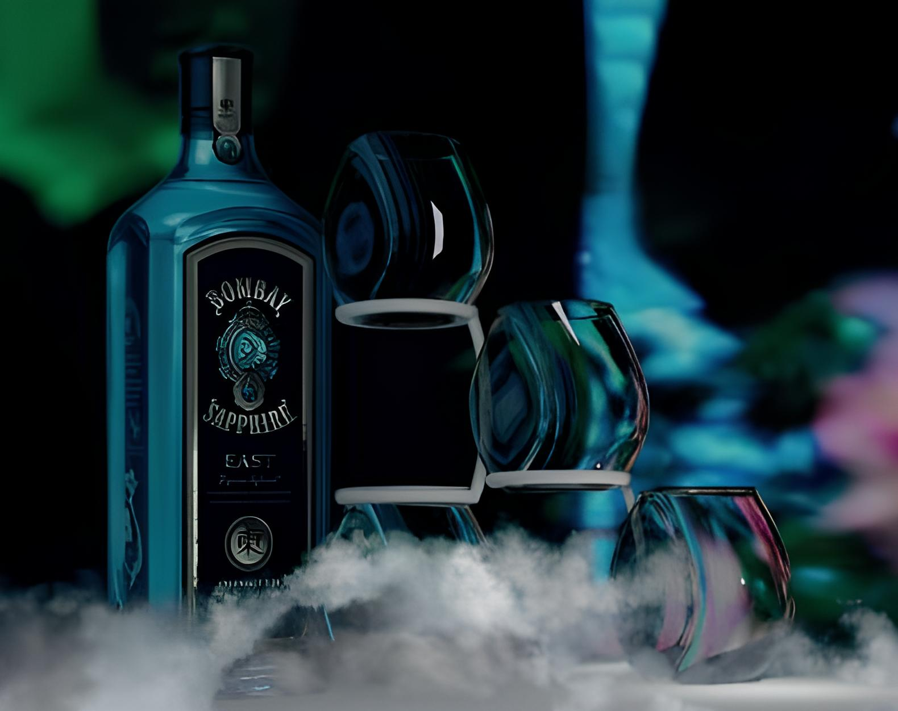
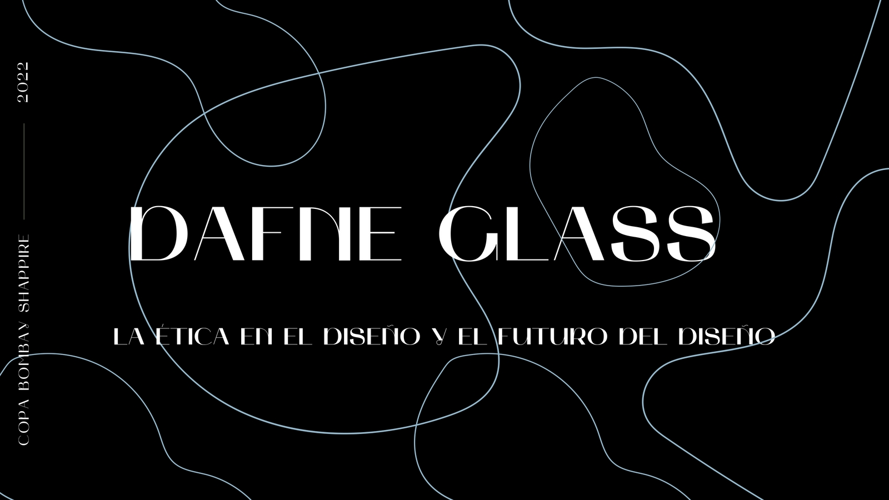
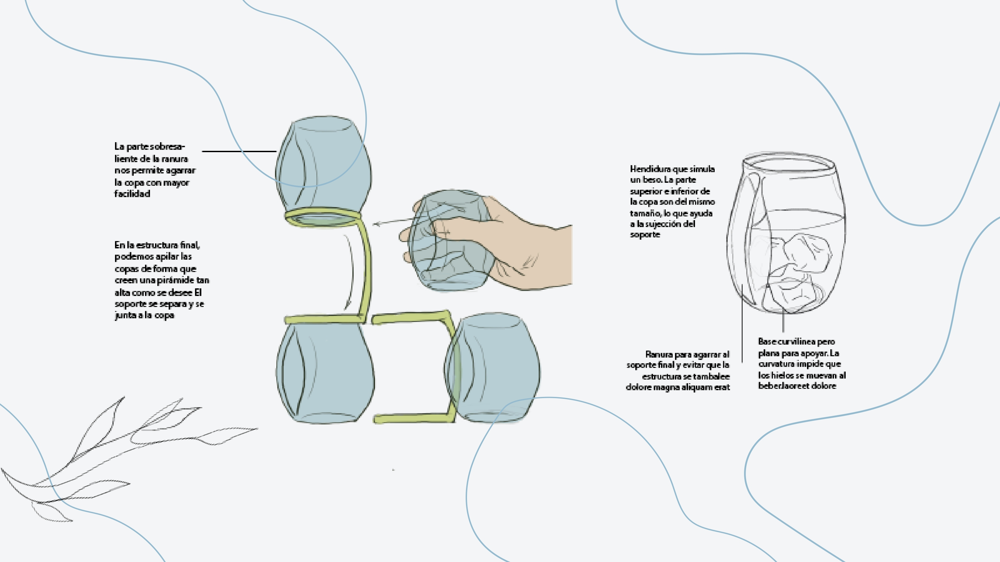
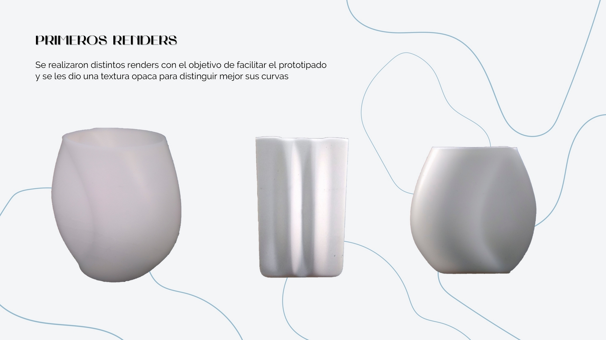
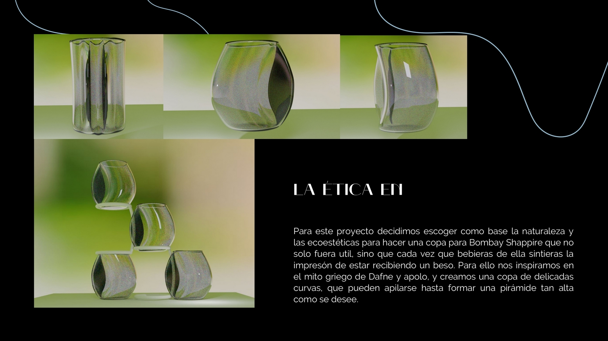
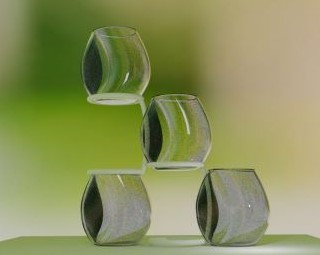

For this project we were inspired by nature and eco-aesthetics, to create a cup for Bombay Shappire that was not only useful, but also allegorical (drinking from it feels like receiving a kiss). The aim was to incorporate shapes that could increase their resistance to breakage and enhance their stability during use, with delicate curves, and a slit in one of its sides that allows them to be stacked.

  <ol class="carousel-indicators">
    <li data-target="#carouselExampleIndicators" data-slide-to="0" class="active"></li>
    <li data-target="#carouselExampleIndicators" data-slide-to="1"></li>
    <li data-target="#carouselExampleIndicators" data-slide-to="2"></li>
    <li data-target="#carouselExampleIndicators" data-slide-to="3"></li>
    <li data-target="#carouselExampleIndicators" data-slide-to="4"></li>
    <li data-target="#carouselExampleIndicators" data-slide-to="5"></li>
    <li data-target="#carouselExampleIndicators" data-slide-to="6"></li>
    <li data-target="#carouselExampleIndicators" data-slide-to="7"></li>
    <li data-target="#carouselExampleIndicators" data-slide-to="8"></li>
  </ol>
  

    

      
    

    

      
    

    

      
    

    

      
    

    

      
    

    

      
    

    

      
    

    

      
    

  

  <a class="carousel-control-prev" href="#carouselExampleIndicators" role="button" data-slide="prev">
    
    Previous
  </a>
  <a class="carousel-control-next" href="#carouselExampleIndicators" role="button" data-slide="next">
    
    Next
  </a>

